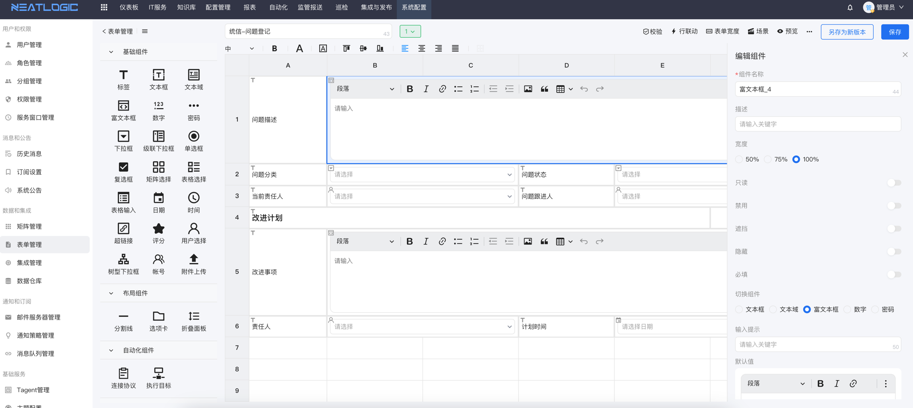
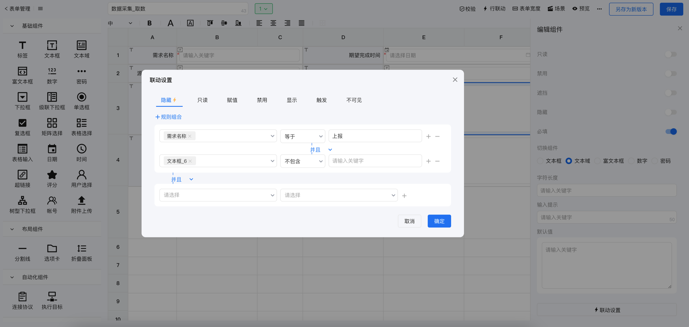
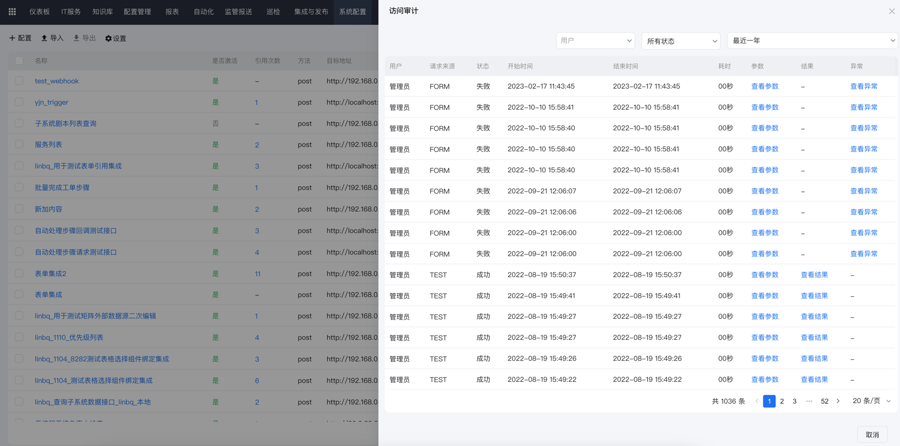
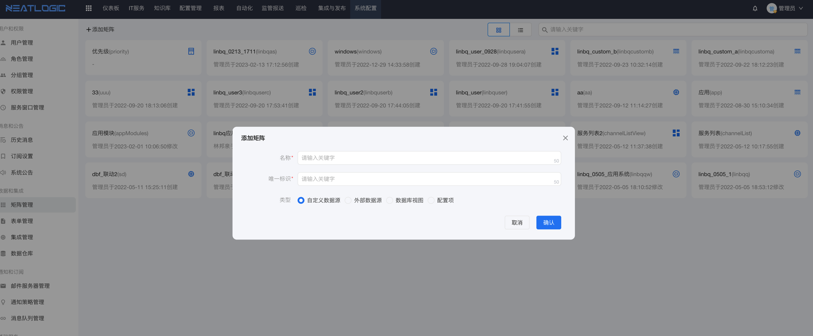

[中文](README.md) / English

    

---

## About

neatlogic-tenant is the business logic module of neatlogic-framework, which provides various basic services of
neatlogic, including user management, authority management, matrix management, integration management, form management,
data warehouse, interface audit, etc.

## Features

### Forms

Custom forms are currently mainly used by the itsm function of neatlogic-process, which can realize most complex form
application scenarios with zero code.

- Native support for various form components.
  

- Support the interaction and linkage between controls through configuration
  
- Support multiple scenarios, each scenario can reset the configuration of the form component, combined with the
  workflow engine, can realize different process steps associated with different form scenarios.
- Supports low-code configuration of custom components.
  

### Integration Management

Integrated management is used to centrally manage external interfaces, and all calls to third-party interfaces need to
be configured here.

- Support writing javascript to convert the structure of input and output parameters, so that the external interface and
  internal functions can be seamlessly connected.
  
- With audit function.
  

### Data warehouse

The data warehouse is used to extract data through query statements and store them in dynamically generated data tables
to meet frequent query scenarios, such as reports, large screens, dashboards, etc.

### Matrix

Matrices are used to convert data into two-dimensional tables and provide data source services for other functions, such
as custom forms. Support custom matrix (edit attributes by yourself), integration matrix (convert the interface in the
integration into a matrix), view matrix (reassemble data through SQL statements), etc.

## All Features

<table border="1"><tr><td>Number</td><td>Category</td><td>Feature</td><td>Description</td></tr><tr><td>1</td><td rowspan="11">Basic</td><td rowspan="5">System Architecture</td><td>The platform adopts a decoupled architecture between the front end and back end, with a pure B/S architecture that does not require the installation of any plugins. It supports access through common browsers via HTTP/HTTPS.</td></tr><tr><td>2</td><td>Supports high availability and distributed deployment of front-end interfaces, back-end services, and execution nodes.</td></tr><tr><td>3</td><td>The platform consists of underlying frameworks and various functional modules. The underlying framework uniformly schedules and loads functional modules, forming a complete ITOM solution.</td></tr><tr><td>4</td><td>The platform has the ability to configure common functional extensions, such as IT service management processes, forms, data matrices, and other features.</td></tr><tr><td>5</td><td>The platform adopts a modular architecture, allowing custom modules to be delivered to meet customer-specific or customized requirements. Users can perform secondary development based on custom modules, including adding modules, adding process components, and interface functions.</td></tr><tr><td>6</td><td rowspan="2">User, Organization, and Role Management</td><td>Supports user, organization, and role management operations such as addition, deletion, modification, and search. It also defines the relationships between users and groups, users and roles, and role and organization permissions.</td></tr><tr><td>7</td><td>No restriction on the organizational hierarchy, supports different levels, group leadership, and position settings.</td></tr><tr><td>8</td><td>Function Permission Management</td><td>Supports assigning function permissions to roles, individuals, and organizational structures, restricting user access and operations.</td></tr><tr><td>9</td><td>Service Windows</td><td>Supports multi-dimensional service window definition, including working days and working time periods.</td></tr><tr><td>10</td><td>Log Audit</td><td>All management operations on the platform are recorded in an audit log, which allows tracing based on the operation object and time.</td></tr><tr><td>11</td><td>Quick Paste</td><td>Supports quick pasting within the platform's rich text box for user convenience.</td></tr><tr><td>12</td><td rowspan="6">Dashboard</td><td rowspan="6">Dashboard Management</td><td>Supports user-defined dashboard data panels at the system level and personal level.</td></tr><tr><td>13</td><td>Supports adding, modifying, deleting, copying, importing, and exporting dashboards.</td></tr><tr><td>14</td><td>Dashboards support common presentation components such as text, data, tables, pie charts, radar charts, bar charts, line charts, area charts, gauges, stacked charts, scatter plots, and heat maps.</td></tr><tr><td>15</td><td>Dashboards support quick data presentation based on selected presentation components and their corresponding data sources through configuration.</td></tr><tr><td>16</td><td>Dashboards support user drag-and-drop layout.</td></tr><tr><td>17</td><td>System-level dashboards can be authorized to users, roles, and organizational structures. Authorized users can view corresponding system-level dashboards.</td></tr><tr><td>18</td><td rowspan="7">Data Source</td><td rowspan="7">Data Matrix</td><td>Supports user-defined data matrix addition, deletion, modification, search, import, and export management.</td></tr><tr><td>19</td><td>Supports user-defined static data sources with custom headers and configured data. They can be used as data sources for dropdown boxes, table selectors, and other components in forms and reports.</td></tr><tr><td>20</td><td>Supports user-configured interface for querying third-party data, which can be used as data sources for dropdown boxes, table selectors, and other components in forms and reports.</td></tr><tr><td>21</td><td>Supports user-configured CMDB view data in this system, which can be used as data sources for dropdown boxes, table selectors, and other components in forms and reports.</td></tr><tr><td>22</td><td>Supports user-configured SQL and the creation of query views to query data from all data tables in the system. It can be used as data sources for dropdown boxes, table selectors, and other components in forms and reports.</td></tr><tr><td>23</td><td>Existing matrices can be copied to create new matrices that are similar to the original ones.</td></tr><tr><td>24</td><td>Matrices support export and import, which can be used for matrix migration between different environments.</td></tr><tr><td>25</td><td rowspan="7">Data Warehouse</td><td rowspan="7">Data Warehouse</td><td>Supports user-defined data warehouse addition, deletion, modification, search, import, and export management.</td></tr><tr><td>26</td><td>Supports converting basic process data tables into higher-level management objects for statistics in the user-defined data warehouse.</td></tr><tr><td>27</td><td>Supports user-defined data sources for the data warehouse.</td></tr><tr><td>28</td><td>Supports user-defined data objects and filter conditions for the data warehouse.</td></tr><tr><td>29</td><td>Supports user-defined data modes for the data warehouse, such as full replacement or incremental append.</td></tr><tr><td>30</td><td>Supports user-defined manual data synchronization and scheduled data synchronization for the data warehouse.</td></tr><tr><td>31</td><td>User-defined data sources can be used in consumption scenarios such as big screens, dashboards, and reports.</td></tr><tr><td>32</td><td rowspan="8">Integration</td><td rowspan="3">Interface Integration</td><td>Supports user-defined integration configuration and management for internal or external REST interfaces, including submission methods, authentication methods, parameter output format conversion, and parameter input format conversion.</td></tr><tr><td>33</td><td>Supports online help dictionaries for input and output parameters of integrated interfaces, and allows direct online interface invocation and testing.</td></tr><tr><td>34</td><td>Supports import, export, and call record auditing of integration interface lists.</td></tr><tr><td>35</td><td rowspan="2">Message Subscription</td><td>Supports subscribing or unsubscribing to messages based on message types.</td></tr><tr><td>36</td><td>Supports temporary and persistent subscriptions for message types.</td></tr><tr><td>37</td><td rowspan="3">Interface Management</td><td>The platform adopts a decoupled architecture between the front end and back end, with data interaction based on standard REST interfaces. Interfaces are divided into internal and external interfaces. The interface management allows viewing of interface parameters, output parameters, help information, authentication methods, and other details.</td></tr><tr><td>38</td><td>Interfaces support enabling or disabling call records to prevent storage space wastage caused by high-frequency interface calls.</td></tr><tr><td>39</td><td>Supports configuring multiple instances for external interfaces, as well as authentication methods, authentication users, authentication passwords, and validity periods.</td></tr><tr><td>40</td><td rowspan="11">Reports</td><td rowspan="6">Report Templates</td><td>Supports adding, copying, importing, and exporting report templates.</td></tr><tr><td>41</td><td>Supports user-defined display interfaces, filter conditions, and data source configurations for report templates.</td></tr><tr><td>42</td><td>Report conditions support common HTML components, such as text boxes, dropdown boxes, multi-select, radio buttons, date pickers, and other controls, as well as binding control data source settings.</td></tr><tr><td>43</td><td>Report presentation supports common components such as tables, line charts, pie charts, bar charts, and other commonly used controls.</td></tr><tr><td>44</td><td>Report data sources support standard TSQL statements and REST interfaces.</td></tr><tr><td>45</td><td>Supports configuring access permissions for reports.</td></tr><tr><td>46</td><td rowspan="5">Report Management</td><td>Supports quickly generating management reports with different dimensions based on templates.</td></tr><tr><td>47</td><td>Supports dividing reports based on permissions, where different users with different permissions can see different reports.</td></tr><tr><td>48</td><td>Supports online real-time modification and update of report configurations without restarting the application service.</td></tr><tr><td>49</td><td>Supports report export in formats such as Word, Excel, and PDF.</td></tr><tr><td>50</td><td>Supports configuring scheduled report sending strategies.</td></tr></table>
